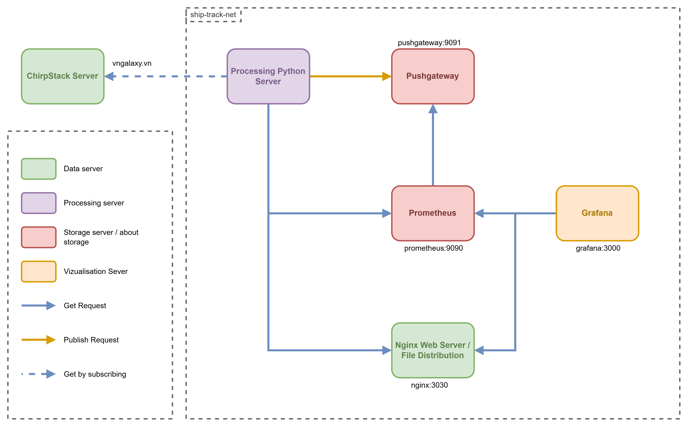

# MONITORING - Maintenance & Deployment
## Context
This document explain how this monitoring application works and how to deploy, maintain it.

## Table of content
 * [Technical explanations](#technical-explanations)
 * [Deployement](#deployement)
 * [Maintenance](#maintenance)

## Technical explanations
### &nbsp; Network and communication
To understand clearly how containers work together and with the environment, here's a schema of connection between different components, and theirs port **INSIDE** the docker's network.



Web access to application :
<div style="display: flex; align-items: center; justify-content: center;">
<table style="width: 350px">
<thead style="background: lightgrey">
    <tr>
        <th style="text-align: center;" scope="col">Application</th>
        <th style="text-align: center;width: 25%" scope="col">Port</th>
    </tr>
</thead>
<tbody style="color: darkred">
    <tr style="color: darkorange;">
        <th scope="row" style=" padding-bottom: 15px; padding-top: 12px">Grafana</th>
        <th scope="row">4445</th>
    </tr>
    <tr>
        <td>Prometheus</td>
        <td>4444</td>
    </tr>
    <tr>
        <td>Pushgateway</td>
        <td>4447</td>
    </tr>
    <tr style="color: darkgreen">
        <td>Nginx</td>
        <td>3030</td>
    </tr>
</tbody>
</table>
</div>

### &nbsp; Data
#### <span style="color: gray; font-weight: bold; font-size: medium; margin-left: 20px;">Data format</span>
Here is the format of data message construction and the data used for :

<image src="../assets/bit_composition_message_Chirpstack.drawio.png" style="max-height: 450px;"/>

#### <span style="color: gray; font-weight: bold; font-size: medium; margin-left: 20px;">Data on Prometheus - Metrics</span>
On Prometheus, datas are registred with **metrics**, which are structured in a special format.

All metrics are in a **job**, where data are stored by **labels**. For exemple, in the Python script, there is a line dedicated to update the metric concerned.

```python
LATITUDE_METRIC.labels(device_id=device_id).set(object_data['latitude'])
```
In this code, the `LATITUDE_METRIC` is updated for metric with labels `device_id=device_id`, with the value `object_data['latitude']`. The job is defined in the definition of the the metric.

On Grafana, with this data structure, you have to request data by metric, and/or with labels, jobs... But it returns **multiple tables** (one by labels, one by metrics, one by jobs...) that you have to **merge** together, and **manipulate** labels to display important data.

## Deployement

This part is a tutorial to deploy the solution.

### &nbsp; Requierements
- Docker, refer to documentation docker : [Install on Ubuntu](https://docs.docker.com/engine/install/ubuntu/) or [Install on Windows Cumputer](https://www.docker.com/products/docker-desktop/)

**<span style="color: red;">ARCHITECTURE ISSUES - AMD/ARM</span>** :\
If your server is based on ARM, you could have issues with grafana images. To resolve it, launch the script at `archlinux_arm64_script/amd64_base_on_arm64.sh` or [here](./archlinux_arm64_script/amd64_base_on_arm64.sh).

You could still have issue, so you have some commands in the "comments" section to try for resolving the problems.

### &nbsp; Permissions
At the same level than this file :
```sh
sudo chown -R 472:472 ./grafana/
sudo chmod -R 755 ./grafana/
```
An error from grafana launch may occur due to permissions restrictions if not given.

### &nbsp; Application deployement
First, you need to verify the consumer is not in debug mode in the code.
```python
...
DEBUG = False
...
```
Now you can launch the application with the script bash `./run.sh`
```sh
sudo bash ./run.sh
```

## Maintenance
First, docker containers do not use versioned images for security update reasons and to troubleshoot potential issues.  
### &nbsp; Grafana
The grafana application used is a customized version. The docker image is available on [Docker Hub](https://hub.docker.com/repository/docker/benneuville/grafana-track-ship/general).<br>
This modified version improves boat monitoring and accessibility with a adapted State Timeline panel.

**<span style="color: red;">WARNING</span>** : By using this customized version grafana will not undergo any updates.

### &nbsp; MQTT Consumer
This part refer to the Python script working on a python server. You can modify the code, differents variables to configure data processing at what you want.

Don't forget to modify the id of application `APP_NUMBER` in the script, by your correct id (refer to this [*README.md*](../README.md#step-3--consumer-chirpstack-application-number)).

### &nbsp; Nginx server
This server is an auto-heberged file server. It used to give documents (like .geojson for zone delimitation) used for data processing and/or display.

You can add/delete/modify files directly in the folder `./datas/`. The volume is shared with the container directly while is up.
